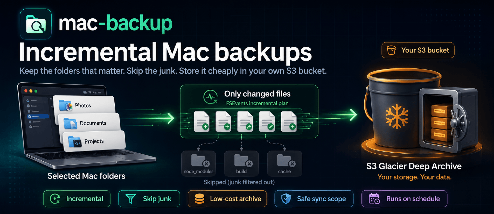

<p align="center">
  
</p>

<h1 align="center">mac-backup</h1>

<p align="center">
  Simple, cheap, incremental macOS backups to S3 Glacier Deep Archive.
</p>

<p align="center">
  <a href="#quick-start"><strong>Quick Start</strong></a>
  ·
  <a href="#why-use-this"><strong>Why Use This?</strong></a>
  ·
  <a href="#configuration"><strong>Configuration</strong></a>
  ·
  <a href="#operations"><strong>Operations</strong></a>
</p>

<p align="center">
  
  
  
  
  
</p>

`mac-backup` is for people who want a real backup of their important Mac folders without paying for a full cloud-drive product, uploading the same files over and over, or accidentally backing up every build artifact on the machine.

It watches the folders you choose, works out what changed, and only syncs the configured roots that need attention. Your data lands in your own S3 bucket using Glacier Deep Archive, so long-term storage stays cheap.

## Why Use This?

- You keep control. Backups go to your own AWS account, not a third-party backup service.
- You save money. Glacier Deep Archive is built for cheap long-term storage.
- You avoid noisy uploads. Common junk like dependencies, build output, caches, and local scratch folders can be excluded.
- You do not need to remember it. `launchd` runs backups on a schedule.
- You can trust the scope. The tool only syncs roots listed in `sync_roots`, and refuses unsafe targets.
- You get fast no-op runs. If nothing important changed, the backup can finish in seconds.

## Quick Start

### 1. Install prerequisites

```bash
xcode-select --install
brew install awscli git
```

`python3` is also required. The system Python that ships with macOS is enough for the included scripts.

### 2. Create an S3 bucket

```bash
ACCOUNT_ID=$(aws sts get-caller-identity --query Account --output text)
BUCKET="${ACCOUNT_ID}-mac-backup"

aws s3 mb "s3://${BUCKET}" --region us-east-1
```

Create AWS credentials with access to that bucket, then configure the AWS CLI:

```bash
aws configure
```

Minimum IAM policy:

```json
{
  "Version": "2012-10-17",
  "Statement": [
    {
      "Effect": "Allow",
      "Action": ["s3:ListBucket", "s3:GetBucketLocation"],
      "Resource": "arn:aws:s3:::YOUR-BUCKET-NAME"
    },
    {
      "Effect": "Allow",
      "Action": ["s3:PutObject", "s3:GetObject", "s3:DeleteObject"],
      "Resource": "arn:aws:s3:::YOUR-BUCKET-NAME/*"
    }
  ]
}
```

### 3. Clone and configure

```bash
git clone https://github.com/yazinsai/mac-backup.git
cd mac-backup

mkdir -p ~/.backup
cp config.json.example ~/.backup/config.json
```

Edit `~/.backup/config.json`:

- Set `s3_bucket` to your bucket, for example `s3://YOUR-BUCKET-NAME`.
- Set `launchd_label` to a unique reverse-DNS label, for example `com.example.mac-backup`.
- Adjust `sync_roots` to the exact local folders you want backed up.
- Adjust `personal_dirs`, `projects_dir`, and `sync_excludes` to match your machine.

### 4. Install the launchd job

```bash
chmod +x install.sh
./install.sh
```

The installer compiles the FSEvents helper, copies runtime files into `~/.backup/`, installs the launchd agent, and seeds the FSEvents cursor so the first incremental run does not blindly upload everything.

### 5. Test it

```bash
~/.backup/s3-backup.sh
tail -f ~/.backup/logs/backup-$(date +%Y-%m-%d).log
```

After that, change a file inside one configured root and run the backup again. The log should show only that root being synced.

## What You Get

- A scheduled backup job that runs in the background.
- Incremental syncs based on macOS FSEvents.
- Low-cost storage in S3 Glacier Deep Archive.
- Clear daily logs in `~/.backup/logs/`.
- Failure notifications without noisy success notifications.
- Configurable backup roots, schedules, and exclude rules.
- Guardrails that prevent empty, absolute, parent-directory, or unconfigured sync targets.

## How It Works

```text
launchd
  └── s3-backup.sh
        ├── fsevents_plan.py   -> decide which configured roots changed
        ├── fsevents-changes   -> replay native macOS FSEvents
        └── aws s3 sync        -> upload deltas to S3 Deep Archive
```

Runtime state lives in `~/.backup/`:

- `bin/` compiled helper binaries
- `lib/` shared Python config loader
- `logs/` daily backup logs
- `state/` FSEvents cursor and planner state

## Configuration

Start from `config.json.example`.

| Field | Purpose |
|-------|---------|
| `s3_bucket` | Destination bucket URI, like `s3://YOUR-BUCKET-NAME` |
| `aws_cli` | Path to the AWS CLI binary |
| `backup_root` | Runtime install directory; defaults to `~/.backup` |
| `sync_roots` | Allowed backup roots, mapped from S3 prefix name to local path |
| `personal_dirs` | Root names considered for normal incremental backups; must be keys in `sync_roots` |
| `projects_dir` | Optional root name for less frequent project/code backups |
| `sync_excludes` | Per-root AWS sync exclude patterns, keyed by `sync_roots` name |
| `fsevents_skip_paths` | Local paths that should not trigger a sync |
| `schedule.primary_hour` | Main launchd run hour |
| `schedule.fallback_hour` | Second chance run hour if the Mac was asleep |
| `launchd_label` | Unique launchd job label |

Example custom roots:

```json
{
  "sync_roots": {
    "Documents": "~/Documents",
    "Design": "~/Design",
    "Code": "~/Code"
  },
  "personal_dirs": ["Documents", "Design"],
  "projects_dir": "Code",
  "sync_excludes": {
    "Code": ["*/node_modules/*", "*/.next/*", "*/dist/*"]
  }
}
```

Only keys listed in `sync_roots` are allowed to sync. The S3 prefix is the key, and the local source is the value.

## Recommended Wake Schedule

`launchd` cannot run a scheduled job while the Mac is asleep. If you want the overnight backup to run reliably, schedule a wake:

```bash
sudo pmset repeat wakeorpoweron MTWRFSU 03:00:00
```

## Operations

| Task | Command |
|------|---------|
| Manual backup | `~/.backup/s3-backup.sh` |
| View today's log | `tail -f ~/.backup/logs/backup-$(date +%Y-%m-%d).log` |
| Check launchd status | `launchctl list \| grep mac-backup` |
| Preview FSEvents plan | `python3 ~/.backup/fsevents_plan.py plan` |
| Reload after config change | `./install.sh` |
| Remove generated junk already uploaded to S3 | `~/.backup/purge-s3-junk.sh` |

## Upgrading

```bash
cd mac-backup
git pull
./install.sh
```

`install.sh` overwrites the installed scripts but preserves runtime state and logs.

## Cost Notes

- S3 Glacier Deep Archive is cheap for storage, but retrieval is slow and not free.
- Deep Archive has minimum storage-duration rules. Avoid backing up noisy files that constantly change.
- The default global excludes skip common build artifacts and dependency directories.
- Use `sync_excludes` and `fsevents_skip_paths` aggressively for caches, generated files, virtual machines, database files, and local scratch folders.

## Repo Layout

```text
mac-backup/
├── README.md
├── install.sh
├── config.json.example
├── launchd/
│   └── com.macbackup.s3.plist.template
├── scripts/
│   └── s3-backup.sh
├── src/
│   ├── config.py
│   ├── fsevents-changes.c
│   └── fsevents_plan.py
├── tests/
│   └── test_fsevents_plan.py
└── tools/
    └── purge-s3-junk.sh
```

## Development

Run tests with:

```bash
python3 -m unittest discover -s tests
```

## License

No license has been specified yet. Add a `LICENSE` file before publishing this as an open-source project.
